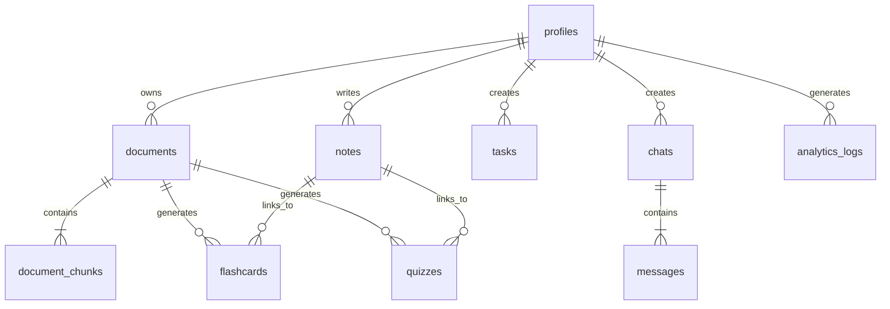

# System Architecture: The Study Flow

An enterprise-grade, AI-powered academic productivity platform combining a Next.js 15 App Router frontend with a FastAPI Python backend, backed by Supabase PostgreSQL (utilizing the `pgvector` extension) and Google Gemini AI API.

---

## 1. Monorepo Repository Structure

The workspace is organized as a unified monorepo to isolate development layers:

```text
the-study-flow/
├── .github/
│   └── workflows/
│       └── ci.yml             # Github Actions CI/CD configuration
├── docs/
│   └── architecture.md        # [This File] Architectural specifications
├── scripts/
│   ├── init_db.sql            # Supabase PostgreSQL schema & migration script
│   └── deploy_verify.py       # Deployment validation check script
├── backend/
│   ├── app/
│   │   ├── core/
│   │   │   ├── config.py      # Environment variables & security configs
│   │   │   └── security.py    # Rate limits and security middleware
│   │   ├── services/
│   │   │   ├── auth.py        # Token decryption & validation
│   │   │   ├── pdf_parser.py  # PyMuPDF text & scanned page OCR fallback
│   │   │   ├── rag.py         # BM25 + pgvector + RRF + Cross-Encoder
│   │   │   ├── ai_agents.py   # Specialised Chat/Quiz/Flashcard/Planner Agents
│   │   │   └── storage.py     # Supabase Storage client
│   │   ├── routers/
│   │   │   ├── auth.py        # Authentication controller endpoints
│   │   │   ├── documents.py   # Document ingestion endpoints
│   │   │   ├── chat.py        # SSE Streaming chat endpoints
│   │   │   ├── flashcards.py  # Spaced repetition flashcards endpoints
│   │   │   ├── quizzes.py     # Interactive quizzes endpoints
│   │   │   └── planner.py     # Planner & Task manager endpoints
│   │   └── main.py            # FastAPI entry point
│   ├── requirements.txt       # Backend dependencies
│   ├── Dockerfile             # Container definition for Hugging Face Spaces
│   └── pyproject.toml         # Ruff, Black, and Pytest configuration
└── frontend/
    ├── app/
    │   ├── layout.tsx         # Root layout with DM Sans & Garamond fonts
    │   ├── page.tsx           # Cinematic landing page
    │   ├── login/             # Glassmorphic authentication page
    │   └── dashboard/
    │       ├── layout.tsx     # Shell navigation with 3D floating icons
    │       ├── page.tsx       # Main dashboard layout
    │       ├── chat/          # Interlinked RAG Chat interface
    │       ├── flashcards/    # Spaced repetition review deck
    │       ├── mindmap/       # Conceptual interactive mind map
    │       └── planner/       # Linear-styled study planner board
    ├── components/
    │   ├── PearlCanvas.tsx    # Three.js Background Particle Flow Field
    │   ├── GlassCard.tsx      # Frosted glass card template component
    │   ├── Icon3D.tsx         # Interactive Three.js metallic-pearl icon
    │   └── ui/                # Shared access widgets
    ├── store/
    │   └── useStore.ts        # Zustand application global state
    ├── hooks/
    │   └── useAuth.ts         # Authentication wrapper hook
    ├── package.json           # Next.js workspace package config
    ├── tailwind.config.ts     # Tailwind glass utilities & style tokens
    ├── next.config.ts         # Dynamic rewrite and asset loaders
    └── tsconfig.json          # Strict TypeScript compiler options
```

---

## 2. Relational Database Schema & pgvector Setup

All tables are hosted on Supabase PostgreSQL. High-speed vector index searches are completed via the `pgvector` extension.



### Table Definitions

1.  **`profiles`**: User demographic and progress tracking metrics.
    *   `id`: `uuid` (Primary Key, matches `auth.users.id`).
    *   `email`: `varchar` (unique).
    *   `full_name`: `varchar`.
    *   `avatar_url`: `text`.
    *   `study_streak`: `integer` (defaults to 0).
    *   `total_study_time`: `integer` (minutes).
    *   `created_at`: `timestamp`.
2.  **`documents`**: Track uploaded study syllabus or textbooks.
    *   `id`: `uuid` (Primary Key).
    *   `user_id`: `uuid` (Foreign Key -> `profiles.id`).
    *   `file_name`: `varchar`.
    *   `file_path`: `text` (Supabase Storage path).
    *   `file_size`: `integer` (bytes).
    *   `mime_type`: `varchar`.
    *   `total_pages`: `integer`.
    *   `metadata`: `jsonb` (extracted title, author, structures).
    *   `created_at`: `timestamp`.
3.  **`document_chunks`**: Fine-grained parsed text fragments for search queries.
    *   `id`: `uuid` (Primary Key).
    *   `document_id`: `uuid` (Foreign Key -> `documents.id` ON DELETE CASCADE).
    *   `page_number`: `integer`.
    *   `content`: `text` (clean string snippet).
    *   `embedding`: `vector(768)` (using Google Gemini 768-dimension embeddings).
    *   `chunk_index`: `integer`.
    *   `metadata`: `jsonb` (parent headers, sliding window indicators).
4.  **`chats`**: Conversation workspace metadata.
    *   `id`: `uuid` (Primary Key).
    *   `user_id`: `uuid` (Foreign Key -> `profiles.id`).
    *   `title`: `varchar`.
    *   `created_at`: `timestamp`.
5.  **`messages`**: Multi-turn history.
    *   `id`: `uuid` (Primary Key).
    *   `chat_id`: `uuid` (Foreign Key -> `chats.id` ON DELETE CASCADE).
    *   `sender`: `varchar` ('user' or 'assistant').
    *   `content`: `text`.
    *   `citations`: `jsonb` (array of chunk IDs and page numbers used to answer query).
    *   `created_at`: `timestamp`.
6.  **`flashcards`**: Flashcard decks for Leitner review.
    *   `id`: `uuid` (Primary Key).
    *   `user_id`: `uuid` (Foreign Key -> `profiles.id`).
    *   `document_id`: `uuid` (Foreign Key -> `documents.id` ON DELETE CASCADE).
    *   `front`: `text` (Question).
    *   `back`: `text` (Answer).
    *   `leitner_box`: `integer` (1 to 5, default 1).
    *   `next_review_at`: `timestamp` (scheduled based on Box status).
    *   `created_at`: `timestamp`.
7.  **`quizzes`**: Assessments generated from documents.
    *   `id`: `uuid` (Primary Key).
    *   `user_id`: `uuid` (Foreign Key -> `profiles.id`).
    *   `document_id`: `uuid` (Foreign Key -> `documents.id` ON DELETE CASCADE).
    *   `title`: `varchar`.
    *   `score`: `integer` (null if not completed).
    *   `questions`: `jsonb` (questions structures, answers, choices).
    *   `created_at`: `timestamp`.
8.  **`tasks`**: Study task scheduler (Kanban/Linear style).
    *   `id`: `uuid` (Primary Key).
    *   `user_id`: `uuid` (Foreign Key -> `profiles.id`).
    *   `title`: `varchar`.
    *   `description`: `text`.
    *   `status`: `varchar` ('backlog', 'todo', 'in-progress', 'done').
    *   `priority`: `varchar` ('none', 'low', 'medium', 'high', 'urgent').
    *   `due_date`: `timestamp` (nullable).
    *   `ai_source_doc`: `uuid` (Foreign Key -> `documents.id` nullable).
    *   `created_at`: `timestamp`.
9.  **`notes`**: Rich text study notes.
    *   `id`: `uuid` (Primary Key).
    *   `user_id`: `uuid` (Foreign Key -> `profiles.id`).
    *   `title`: `varchar`.
    *   `content`: `text` (Markdown content).
    *   `linked_document_id`: `uuid` (Foreign Key -> `documents.id` nullable).
    *   `created_at`: `timestamp`.
10. **`analytics_logs`**: Capture metrics.
    *   `id`: `uuid` (Primary Key).
    *   `user_id`: `uuid` (Foreign Key -> `profiles.id`).
    *   `activity_type`: `varchar` ('read', 'chat', 'quiz', 'flashcard_review').
    *   `duration_seconds`: `integer` (duration of task).
    *   `created_at`: `timestamp`.

---

## 3. Hybrid RAG System Flow & Math

Our Hybrid RAG engine merges lexical (BM25) and semantic searches to produce context matching.

### Vector Search Indexing
*   Vector space distance calculation uses **Cosine Distance**.
*   We compile database indexing using HNSW (Hierarchical Navigable Small World) parameters:
    ```sql
    CREATE INDEX ON document_chunks 
    USING hnsw (embedding vector_cosine_ops);
    ```

### Reciprocal Rank Fusion (RRF)
To fuse sparse BM25 scores and dense pgvector cosine margins, we calculate the combined score using RRF:

$$RRF(d) = \sum_{m \in M} \frac{1}{k + r_m(d)}$$

Where:
*   $M$ represents the set of retrieval methods ($M = \{\text{BM25}, \text{pgvector}\}$).
*   $r_m(d)$ represents the rank position of document chunk $d$ in the result set from method $m$ (1-indexed).
*   $k$ is a constant damping factor (typically $k = 60$ to avoid excessive weight for outlier results).

### Cross-Encoder Re-ranking
After fusing candidate ranks using RRF, a secondary fast sorting filter runs:
1.  Isolate the top 15 candidate chunks.
2.  Pass candidates through a local Lightweight Cross-Encoder re-ranker or high-performance relevance analysis wrapper inside our AI service.
3.  Cut down results to top $K$ (usually $K = 5$) to fit the context window optimally.

---

## 4. Multi-Agent AI System Design

Specialized Gemini AI Agents are instantiated using dedicated System Prompts, temperatures, and function tools:

| Agent Name | Primary Model | Task Responsibility | Output Specification |
| :--- | :--- | :--- | :--- |
| **Chat Agent** | Gemini 2.5 Flash | User prompt context answers. | Streaming markdown paragraphs + inline citation links like `[page 4]`. |
| **Quiz Agent** | Gemini 2.5 Flash | Generate questions based on uploaded content. | JSON format array containing multiple-choice keys, options, and explanations. |
| **Flashcard Agent**| Gemini 2.5 Flash | Extract facts and summarize question/answer cards. | Simple JSON array containing `front` and `back` strings. |
| **Planner Agent** | Gemini 2.5 Pro | Analyze syllabus pages to build milestones. | JSON objects detailing chronological lists, dependencies, and priorities. |
| **Mind Map Agent** | Gemini 2.5 Pro | Scan text and map relationship webs. | JSON structures of node linkages (`id`, `label`, `connections: []`). |
| **Analytics Agent**| Gemini 2.5 Pro | Synthesize logs to provide recommendations. | Text-based personal tutor advice, highlighting subject weaknesses. |

---

## 5. Security & Isolation Controls

1.  **Row Level Security (RLS)**:
    Every PostgreSQL table enforces strict user separation. By default, tables are isolated so users can only perform operations on their own rows:
    ```sql
    ALTER TABLE public.documents ENABLE ROW LEVEL SECURITY;
    CREATE POLICY "Users can only access their own documents"
      ON public.documents
      FOR ALL
      USING (auth.uid() = user_id);
    ```
2.  **MIME Magic-Bytes Validation**:
    When a PDF is received, the backend will inspect the file header bytes (`%PDF-` at position 0) rather than trusting the browser `Content-Type` header.
3.  **FastAPI Rate-Limiting**:
    A custom token bucket rate limiter intercepts incoming API calls, capping requests at:
    *   Auth routers: 10 requests / minute per IP.
    *   AI Generation: 15 requests / minute per user token.

---

## 6. Logging, Monitoring & Diagnostics

*   **Endpoint `/health`**:
    Checks database connections, Supabase authentication server availability, and Gemini API connectivity.
*   **Structured Output**:
    All Python backend server logs are configured using a JSON structurer (`json-logging` style) to output logs to standard stdout:
    ```json
    {
      "timestamp": "2026-06-27T14:48:00.00Z",
      "level": "INFO",
      "logger": "app.services.rag",
      "message": "Hybrid RAG completed search",
      "elapsed_ms": 112.4,
      "user_id": "96f014a5-..."
    }
    ```
